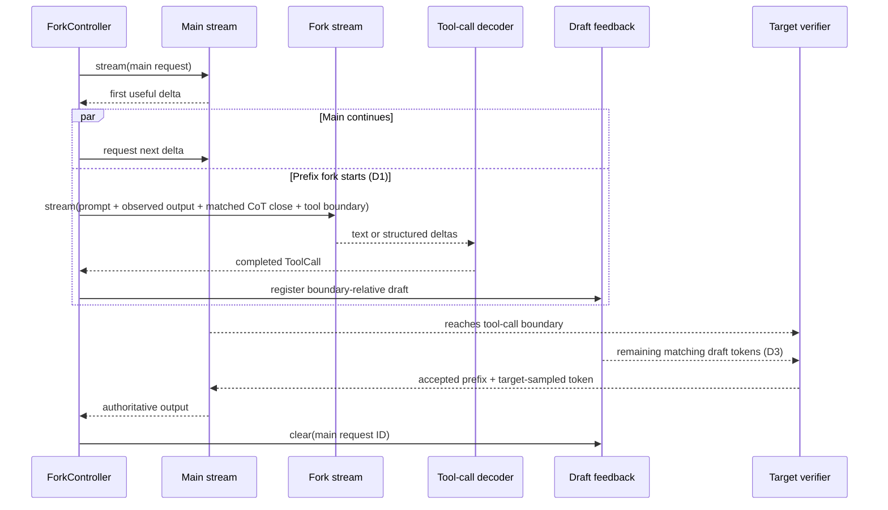

# Architecture

`self-speculation` extracts two reusable mechanisms from SPORK:

1. **D1-style streaming fork:** after the first useful Actor-stream delta, start
   one continuation that shares the already-populated prefix and force it onto a
   tool-call branch.
2. **D3-style action drafting:** decode the fork into a complete action, encode
   that action as boundary-relative draft tokens, and offer those tokens to the
   still-running main request for ordinary target-model verification.

Agent loops, tool execution, benchmark harnesses, datasets, scheduling policy,
and evaluation code are intentionally outside this package.

## End-to-end flow



The fork predicts an action; it never replaces the Actor stream. Drafter-model
requests are external candidate producers and are never self-forked. When D3 is
enabled, the target engine verifies every proposed token using its normal
speculative-decoding path. Rejected tokens therefore fall back to target-model
decoding instead of changing the model's output distribution.

Text continuations are format checked before dispatch. Tool-call boundaries
come from the same syntax table used by D3 formatting, while CoT exits come
from the envelope that is actually open in the rendered prefix. Opaque signed
reasoning blocks (for example provider-managed thought state) cannot be safely
converted to a suffix and therefore require a native fork implementation.

## Components

### Normalized inference contract

An engine implements one asynchronous method:

```python
class InferenceEngine(Protocol):
    name: str
    capabilities: EngineCapabilities

    def stream(self, request: InferenceRequest) -> AsyncIterator[StreamChunk]: ...
```

`InferenceRequest` supports either a raw prompt or chat messages. `StreamChunk`
keeps visible text, reasoning text, token IDs, token logprobs, structured
tool-call deltas, finish reasons, and provider-native payloads separate.

Built-in adapters cover arbitrary callbacks, OpenAI-compatible SSE servers,
native vLLM asynchronous generation, in-process Transformers, and in-process
`llama-cpp-python`. A custom engine only needs to normalize its output into
this contract.

### Fork construction

`PrefixForkBuilder` appends the main stream's observed output and a forced
tool-call boundary to the original rendered prompt. Starting after the first
delta follows SPORK's D1 timing and lets engines with automatic prefix caching
reuse the main request's populated prefix. `CallableForkBuilder` supports
engines that need a different continuation or session API.

The fork is opened at most once. Main and fork iterators then advance as
independent asyncio tasks; a slow fork does not stop consumption of the main
stream. Completed calls are emitted as they become parseable, but D3 submission
waits for the fork's terminal boundary and atomically uses the complete decoded
batch. This prevents the first parallel call from prematurely closing the
candidate while preserving concurrent main-stream progress.

If the authoritative main stream finishes first, its completion wins the race:
the unfinished fork and draft submission are cancelled and the fork iterator is
closed. A late prediction cannot accelerate the completed request and must not
keep `run()` or request-scoped engine state alive.

### Streaming tool-call decoding

`StreamingToolCallDecoder` accepts both structured provider deltas and raw text.
For text, `ParserRegistry` tries configured branches in order, locks onto the
first matching parser, and deduplicates completed calls. Parser instances keep
partial state, so JSON strings, XML tags, and special-token markers may span
arbitrary transport chunks.

When `PrefixForkBuilder` forces a boundary that the engine will not echo, pass
that text as `initial_text` to `default_decoder`. This reconstructs the logical
stream seen by the parser.

### Draft construction and feedback

`ToolCallDraftBuilder` separates model-format concerns from engine transport:

- a formatter serializes decoded calls after, but not including, the boundary;
- a tokenizer encodes both the draft body and textual boundary;
- an optional resolver supplies the main prompt token count;
- `max_draft_tokens` bounds work offered to the verifier.

One `DraftRequest` represents one boundary-relative continuation. A
`DraftBundle` preserves the ranking of several alternative continuations for
the same active target request. `DraftFeedback` always replaces that complete
set atomically; one candidate is simply a bundle of size one. There is no
separate single-draft mutation path. Implementations include:

- `CallableDraftFeedback` for local engines or application callbacks;
- `HTTPDraftFeedback` for a portable request-scoped sidecar;
- `SporkHTTPDraftFeedback` for the original SPORK endpoint contract;
- `BoundaryDraftFeedback` for an in-process `BoundaryDraftStore`;
- vLLM collective-RPC and HTTP adapters for the custom proposer integration;
- `SGLangHTTPDraftFeedback` for the SGLang NGRAM plugin;
- native Transformers assisted decoding and `llama-cpp-python` draft-model
  callbacks, where the engine adapter also implements `DraftFeedback`.

The optional agent-facing control plane accepts already-materialized tool calls
from Drafter, PatternAware, or another predictor and builds their drafts with
the target tokenizer. A D1 snapshot fork can contribute another draft to the
same bundle. Equality is based on complete draft content and boundary, not a
truncated prefix; duplicate content keeps merged source, candidate-ID, and
proposal provenance. The snapshot runner likewise consumes its complete fork
stream before building that draft. Its bounded receipt projection retains all
tool-call indexes, provider call IDs, formats, source/candidate attribution,
scores, fork timing, logprobs, and proposal provenance for downstream policy.

The agent protocol keeps two action identities. `predicted_action_id` names the
exact Actor-visible call represented by the draft and owns verification;
`execution_action_id` may name a wider operation that can reconstruct that
call through a lossless projection. Draft-content deduplication may combine
their metadata, but it never rewrites one predicted identity into the covering
execution identity.

### Engine-side boundary proposer

`BoundaryDraftStore` is independent of vLLM and uses stable request IDs. For
each proposer step it:

1. excludes exactly `prompt_token_count` tokens, so historical tool calls in a
   chat prompt cannot trigger the current draft;
2. finds the last occurrence of a single- or multi-token boundary;
3. rejects a draft outside `inject_window`;
4. requires every body token already generated by the main request to equal a
   prefix of the draft;
5. skips that common prefix and offers only the ungenerated suffix;
6. marks that candidate fired, ensuring at most one thread receives it;
7. after target divergence, considers the next ranked candidate at a later
   sequence position.

Every offer also becomes one pending verification step. An engine with a
native acceptance callback resolves it directly; otherwise the next target
sequence resolves it by longest common prefix. The request-scoped outcome
records candidate index/ID and drafted, accepted, and rejected token counts.
Cleanup never invents feedback: a final pending offer is returned as
`unresolved_proposals` and `unresolved_draft_tokens`. Consequently,
`DraftReceipt.accepted_token_count` from registration must not be used as an
online acceptance signal.

When equal complete drafts merge, each verification step also returns the full
`candidate_ids` and `sources` sets captured at registration. This lets an agent
update source-aware decoder calibration while keeping action adoption and
execution-latency evidence in the action Runtime.

`DraftFeedback.clear()` returns the optional `DraftVerificationOutcome` after
atomically removing request state. HTTP and vLLM RPC bridges preserve the same
shape under `verification`; aggregate field names intentionally match vLLM's
per-request speculative-decoding metrics, while `steps` adds the candidate
identity required for source-aware calibration.

Registration, proposal, incremental bundle replacement, cleanup, and metrics
are protected by one re-entrant lock. Different requests never share proposal
state. Replacement preserves fired candidate identities and the last offered
sequence length, preventing a repeated control update from injecting the same
choice twice.

## Failure semantics

The main stream is authoritative, so its exceptions always propagate. Fork and
draft work are acceleration paths and default to best-effort behavior:

| Stage | Default behavior | Strict option |
| --- | --- | --- |
| Fork build, stream, or decode | emit `ForkFailedEvent`; main continues | `strict_fork_errors=True` re-raises |
| Draft build, submit, or clear | emit `DraftFailedEvent`; main continues | `strict_draft_errors=True` re-raises |
| Consumer cancellation | cancel pending tasks, close iterators, best-effort draft cleanup | always applied |

Typed events expose lifecycle transitions without requiring callers to parse
logs. `ForkController.run()` collects the same information into `ForkRunResult`.

## Engine integration levels

An engine can adopt the library incrementally:

| Level | Requirements | Result |
| --- | --- | --- |
| Streaming fork | normalized stream + a fork request builder | speculative tool-call prediction |
| Prefix-efficient fork | automatic prefix/KV cache reuse | D1 latency reduction |
| Action feedback | tokenizer + request-scoped side channel | one or more decoded/external actions reach engine |
| Verified D3 | stable request-ID mapping + boundary proposer + target verification | speculative action tokens can reduce decode steps |

Without the last level, the decoded fork is still useful for prefetching or
application policy, but it does not accelerate target-model token generation.

## Security boundary

Draft registration routes influence inference execution and must be treated as
administrative endpoints. Keep them on a trusted network or protect them with a
reverse proxy. In particular, vLLM API-key handling may not cover plugin routes
outside `/v1`; the bundled endpoint plugin is opt-in and namespaced under
`/self-speculation` for this reason. SGLang's root-level
`/add_external_corpus` and `/remove_external_corpus` routes require the same
protection when used as the D3 control plane.

## Upstream relationship

The design and D1/D3 terminology come from
[SPORK](https://github.com/baihuajun24/spork) and its
[paper](https://arxiv.org/abs/2607.03333). This repository preserves the
upstream Git history, MIT license, and explicit attribution in `NOTICE.md`.
